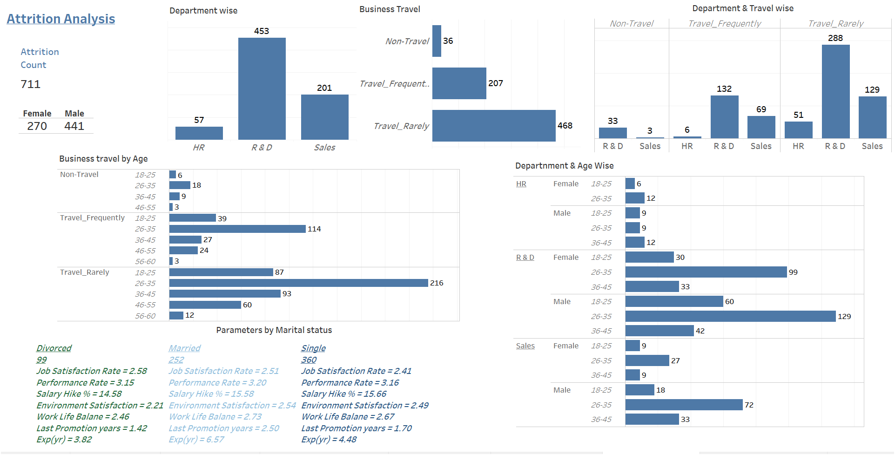
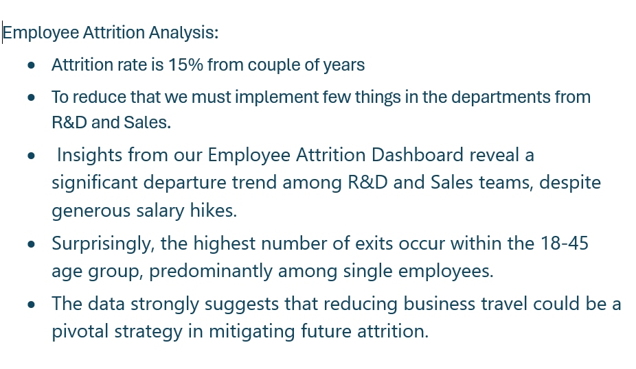

# Employee Attrition Tableau Dashboard - [Dashboard_Link](https://public.tableau.com/views/EmployeeAttritionAnalysisDashboard_17186491130160/AttritionDashboard?:language=en-US&publish=yes&:sid=&:display_count=n&:origin=viz_share_link)

## Project Overview:
This Employee Attrition Analysis Dashboard is designed to provide comprehensive insights into employee turnover within an organization. It utilizes Tableau to visualize key metrics, demographic breakdowns, and predictive trends, helping HR teams understand and address the factors contributing to employee attrition.

## Key Features:
- Attrition Rate Overview
- Demographic Breakdown
- Reasons for Leaving
- Trend Analysis
- Predictive Analytics
- Performance vs. Attrition Analysis

## Tools Used: Tableau

